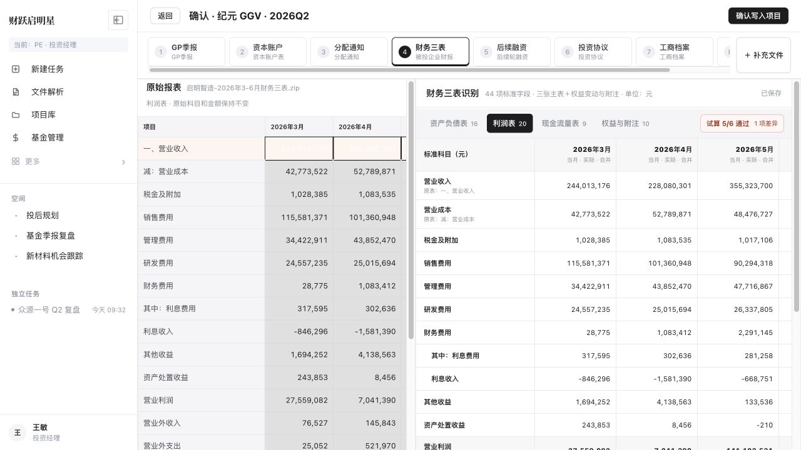
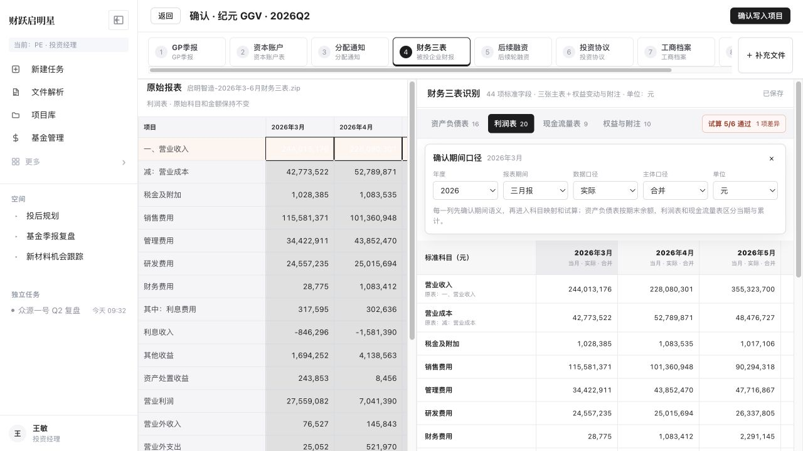
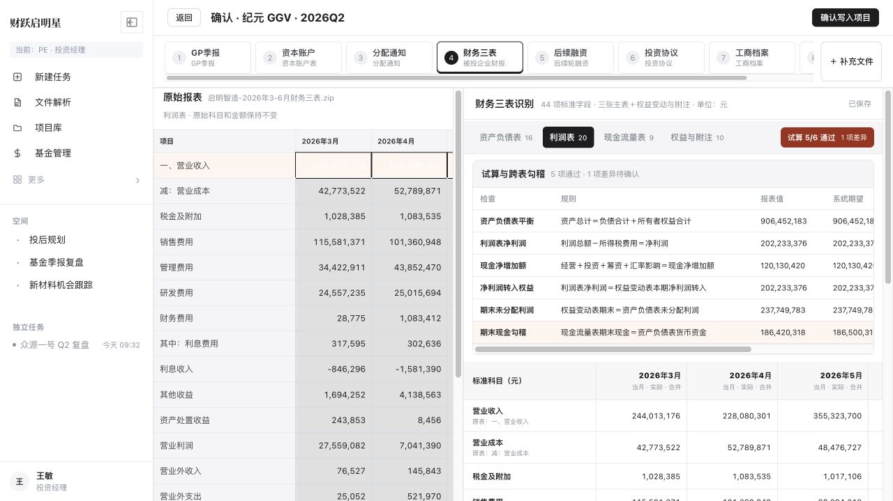

# 财务三表解析与科目配置 PRD

| 文档信息 | 内容 |
| --- | --- |
| 文档名称 | 财务三表解析与科目配置 |
| 版本状态 | v1.0 · 开发对齐稿 |
| 更新日期 | 2026-08-02 |

## 1. 产品说明

### 1.1 背景

当前财务解析把财务数据当成一组普通字段，丢失了“报表—科目—期间”的矩阵结构，也无法解释月度发生额、累计数、期末余额和合并口径。用户真正要完成的是：确认报表口径、修正科目映射、处理试算差异，再将可信数据写入项目。

### 1.2 用户

- 投资经理：确认被投企业财务数据，处理差异并写入项目。
- 配置管理员：维护机构标准科目、来源别名、指标公式和校验规则。

### 1.3 功能范围

1. 识别资产负债表、利润表、现金流量表及权益与附注。
2. 识别每一列的年度、报告期、当期或累计、实际或预测、主体和单位。
3. 以标准科目为行、报告期为列展示财务矩阵，并保留原始科目与来源位置。
4. 支持表内试算、跨表勾稽、差异定位和人工修正。
5. 以机构科目库配置科目别名、指标公式、期间规则和校验规则。

### 1.4 目标与资源

目标是让投资经理在一个页面完成“看原表—核口径—改数据—看试算—确认写入”。研发实现以用户提供的《文件解析字段映射》44 项财务字段为基础，利润表模拟数据取自用户样例；交互参考投资云、芯鑫租赁 v2.1 和启明星 agent-demo 科目配置。

> 研发沟通统一采用：业务对象—页面状态—用户动作—系统规则—异常处理—证据来源。未写清这六项的需求，不进入开发。

## 2. 页面与规则

### 2.1 财务三表确认页

| 模块 | 研发说明 |
| --- | --- |
| 返回与确认 | 页面左上保留“返回”；全页只有右上一个“确认写入项目”，试算差异未处理时点击需二次确认。 |
| 来源文件 | 顶部沿用现有来源文件条；点击“财务三表”进入财务工作台，不增加二级“结构化字段”页签。 |
| 原始报表 | 左侧展示当前报表原文；切换报表或点击来源位置时同步定位，原始科目和原始数值不得被标准化结果覆盖。 |
| 报表导航 | 右侧只保留资产负债表、利润表、现金流量表、权益与附注四个入口；前三个为主表，权益变动和附注为附表。 |
| 财务矩阵 | 行是机构标准科目，列是报告期间；单元格可修正，修改后自动保存并重新执行受影响的试算规则。 |
| 行级来源 | 每行显示标准科目、原始科目别名和原始位置；点击位置定位左侧原文，不再增加独立“来源”层级。 |
| 期间列 | 资产负债表按时点余额；利润表和现金流量表区分当期与累计；不同主体、币种或单位不得合并为同一列。 |
| 展示状态 | 正常行白底；合计行加粗；存在差异的行浅红提示；未识别值留空并说明缺口，不生成推测值。 |

### 2.2 报告期口径

| 规则 | 研发说明 |
| --- | --- |
| 打开方式 | 点击任一期间列头，在当前工作台内展开配置，不跳转新页面。 |
| 必填属性 | 年度、报告期间、数据口径、主体口径、单位为必填；利润表与现金流量表还需保存当期或累计语义。 |
| 期间标准化 | 原始期间语义先确认，随后才允许执行累计转单季、单位换算和指标计算；派生值必须记录公式与原始输入。 |
| 口径冲突 | 同一列识别到多个期间或主体时标记“待确认”，相关试算暂停，不自动选择一个结果。 |
| 修改影响 | 修改期间配置后，刷新该列科目映射、派生计算和试算结果，但保留用户已手工确认的原始值。 |

### 2.3 试算与跨表勾稽

| 规则 | 研发说明 |
| --- | --- |
| 入口 | 报表导航右侧显示“通过数/总数”和待确认差异数，点击后在矩阵上方展开。 |
| 表内试算 | 至少包含资产负债表平衡、利润总额减所得税等于净利润、现金净增加额重算。 |
| 跨表勾稽 | 至少包含净利润转入权益、期末未分配利润、期末现金与货币资金勾稽。 |
| 结果字段 | 每条规则展示规则名称、公式说明、报表值、系统期望、差额和来源位置。 |
| 差异处理 | 点击差异来源，切换到对应报表并定位科目；用户修改值后即时重算，差异归零才转为通过。 |
| 写入条件 | 全部通过可直接确认；存在差异时允许保存草稿，正式写入需用户明确确认保留差异及原因。 |

### 2.4 财务科目配置

| 模块 | 研发说明 |
| --- | --- |
| 配置范围 | 支持平台标准科目库和机构科目库；机构配置可覆盖平台默认，不修改历史已发布版本。 |
| 一级对象 | 只保留科目与映射、指标计算、校验规则三个一级入口，期间列规则归入科目与映射。 |
| 科目库 | 按利润表、资产负债表、现金流量表分组；列表展示标准科目、来源别名和别名数量。 |
| 科目编辑 | 支持标准科目名称、所属报表、来源别名；一对多或低置信度映射进入人工确认。 |
| 匹配顺序 | 精确匹配、包含匹配、正则匹配、语义兜底依次执行；每次命中均保留原始科目和使用规则。 |
| 指标计算 | 指标引用标准科目 ID 和期间口径，不直接引用来源科目文本；公式变更需版本化。 |
| 校验规则 | 规则配置公式、适用报表、严重级别和差异阈值；发布后用于新任务，存量任务保持原版本。 |
| 发布 | 编辑过程自动保存草稿；点击发布生成新版本，并记录发布人、发布时间和变更项。 |

## 3. 核心流程

1. 用户上传财务报表，系统识别报表类型、原始科目、原始值和来源位置。
2. 系统识别期间列，用户确认年度、期间、当期或累计、主体和单位。
3. 系统按当前机构科目库将来源科目映射到标准科目。
4. 系统进行单位换算与期间标准化，并记录派生公式和原始输入。
5. 用户在标准科目矩阵中检查或修正数值，系统自动保存。
6. 系统执行表内试算和跨表勾稽，展示差异及对应来源。
7. 用户定位并处理差异，或填写保留差异原因。
8. 用户确认写入项目，系统保存正式数据、来源、规则和配置版本。

## 4. 变更记录

| 版本 | 日期 | 变更内容 |
| --- | --- | --- |
| v1.0 | 2026-08-02 | 重构三表确认、试算平衡和科目配置。 |
